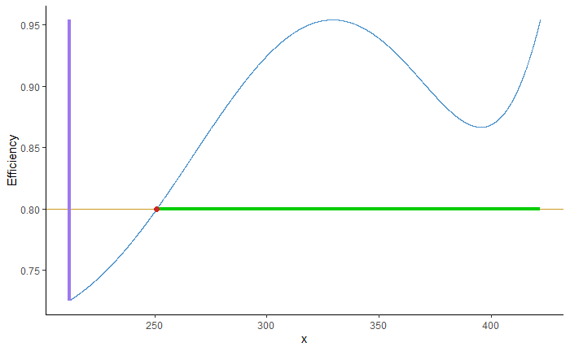
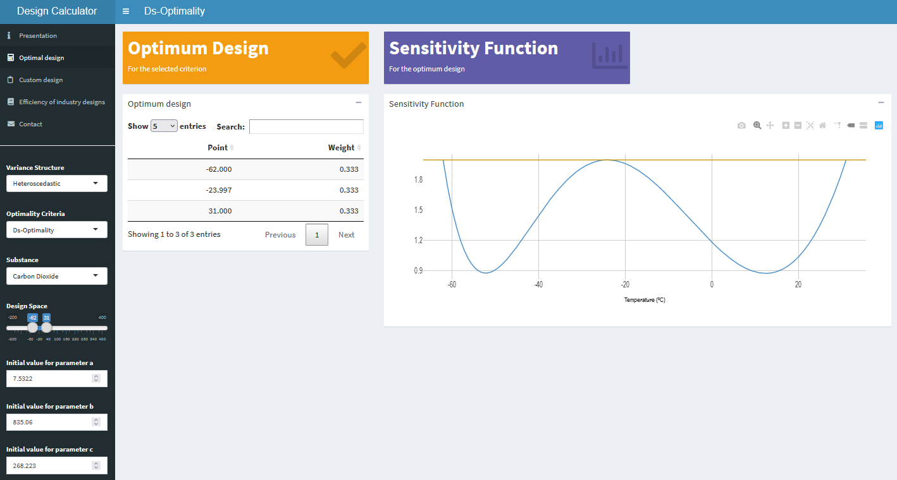
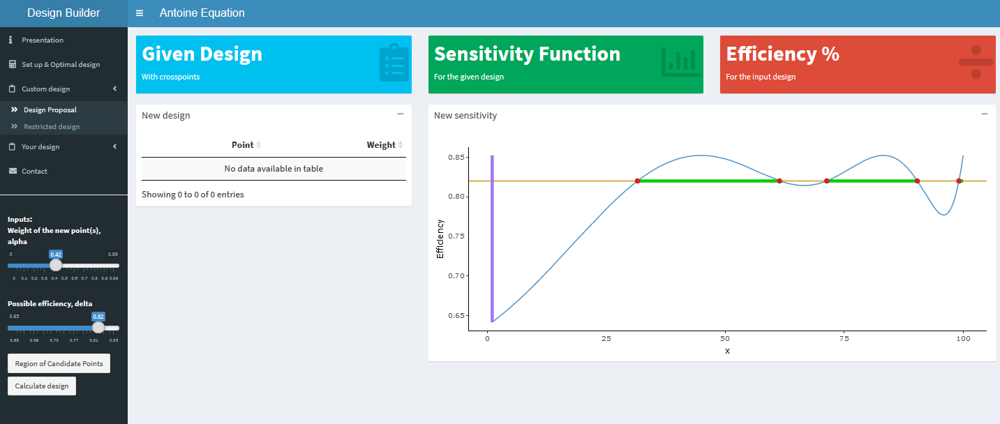

class: chapter-slide

# Outline


---

## Outline

- Optimal design calculation
- Evaluating designs: `optdes` class
- D-augmentation
- Efficient rounding
- Shiny demos
- Summary and future improvements

---

class: chapter-slide

# Optimal Design Calculation

```{r, include = FALSE, echo = FALSE}
library(optedr)
library(mockery)
```

---

## Regression model

$$y(x)=\eta(x;\theta)+\varepsilon\quad, $$

with $\theta$ the unknown parameters of the model, of interest for the experimenter.

---

## Exact design

A collection of points (with replicates) to take measures


## Aproximate design

A design, $\xi$, as a probability measure (discrete approximate design) which have nice theoretical and practical properties.

---

## FIM

$$
M(\xi,\theta)=\sum_{x\in\mathcal{X}}f(x)f^t(x)\xi(x),
$$

with $f(x)=\partial\eta(x, \theta)/\partial\theta$


## Optimality criteria

- D-optimality:  $\Phi_D=|M(\xi)^{-1/k}|$
- $D_s$-optimality: $\Phi_{D_S}=\left \{\frac{|M(\xi)|}{|M_{22}(\xi)|}\right\}^{-1/s}$
- A-optimality: $\Phi_A=\text{Tr} (M^{-1})$
- I-optimality: $\Phi_I=\text{Tr} (AM^{-1})$, with $A=\int_{\mathcal{R}}\mu(x)f(x)f(x)^Tdx$.

---

## General Equivalence Theorem

A design $\xi^\star$ is $\phi$-optimal if and only if,

$$Tr \left\{\nabla \phi(\xi^\star)[M(\xi^\star, \theta)-f(T)f^t(T)]\right\}\leq 0,  T\in\mathcal{X}$$

The equality holds on the support points of the design, and for the interior points is a local maxima.


## Efficiency 

The efficiency of a design $\xi_1$, for a certain criterion, with respect to another design $\xi_2$ can be defined as

$$
eff_\Phi = \frac{\Phi(\xi_1)}{\Phi(\xi_2)}
$$


---


## Cocktail algorithm

1. Start With a non-singular design
2. Add $x$ such that $\max_{x\in\chi} f^t(x)\nabla \phi(\xi)f(x)$ 
3. Optimise weights via multiplicative algorithm
4. Apply heuristic
5. Check optimality, if the threshold is not met repeat 2-5


---

## Multiplicative algorithm

1. Start with a non-singular design
2. Update $\xi(x_i)^{r+1} \gets \xi(x_i)^{r} \left(\frac{ f^t(x)\nabla \phi(\xi^r)f(x)}{Tr M^r(\xi^r, \theta)\nabla\phi(\xi^r)}\right)^\delta$
3. If $\max_i(|\xi(T_i)^{r+1}-\xi(T_i)^r|)\leq \epsilon$ stop, else repeat 2-3


---


## Calculate optimal design

```{r}
resArr.D <- opt_des("D-Optimality",
  model = y ~ a*exp(-b/x),
  parameters = c("a", "b"),
  par_values = c(1, 1500),
  design_space = c(212, 422))

resArr.D$optdes
```

---

## Sensitivity function


```{r, out.width="48%", fig.align='center', fig.alt="Sensibility function of the design"}
resArr.D$sens
```


---

## Algorithm convergence and criterion value


```{r, out.width="48%", fig.align='center', fig.alt="Convergence of the cocktail algorithm"}
resArr.D$convergence
```


```{r}
resArr.D$crit_value
```


---

## Other optimality criteria

```{r}
resMM.A<-opt_des("A-Optimality",
  y ~ V*x/(K+x),
  c("V", "K"),
  c(1, 1.70),
  c(0.34, 8.5))

resMM.A$optdes
```


---

## Exponential distributions


```{r}
t0 <- 0.95
t1 <- -1
t2 <- -1
var_poisson <- function (x) exp((t0 + t1 * x + t2 * x^2)/2)

poissionDopt <- opt_des("D-Optimality", 
   y ~ t0 + t1 * x + t2 * x^2, c("t0","t1","t2"), 
   c(0.95, -1, -1), c(0, 0.5799), weight_fun = var_poisson)
poissionDopt$optdes
```


---


## Heuristics


```{r}
FP2_00 <- opt_des("I-Optimality",
  y ~ a0 + a1*log(x) + a2*log(x)^2,
  c("a0", "a1", "a2"),
  c(1, 1, 1),
  c(0.0001, 1),
  reg_int = c(0.0001, 1))

FP2_00$optdes
```


---


## Heuristics


```{r}
FP2_00 <- opt_des("I-Optimality",
  y ~ a0 + a1*log(x) + a2*log(x)^2,
  c("a0", "a1", "a2"),
  c(1, 1, 1),
  c(0.0001, 1),
  reg_int = c(0.0001, 1),
  join_thresh = 0.005)

FP2_00$optdes
```


---

class: chapter-slide

# Evaluating designs: `optdes`class


---


## Design efficiency

```{r}
design <- data.frame("Point" = c(220, 240, 400),
  "Weight" = c(1/3, 1/3, 1/3))

design_efficiency(resArr.D, design)
```


---

## Design efficiency: criterion function

```{r}
Idesign <- data.frame("Point" = c(0.1, 0.3, 0.9, 1),
  "Weight" = c(1/5, 0.3, 0.3, 1/5))

design_efficiency(FP2_00, Idesign)
```


---

## `optdes` class

```{r}
print(resArr.D)

summary(resArr.D)
```


---

## `optdes` class


```{r, out.width="48%", fig.align='center', fig.alt="Optimal design plot"}
plot(resArr.D)
```


---

class: chapter-slide

# D-augmentation

---

## Design augmentation

```{r, include = FALSE}
aug_arr <- data.frame("Point" = c(329.2966, 422.0000, 260.0, 380.0), "Weight" = c(0.3500048, 0.3499952, 0.15, 0.15))
```


```{r, eval = FALSE}
aug_arr <- augment_design(resArr.D$optdes, 0.3, 
               y ~ a * exp(-b/x),
               parameters = c("a", "b"),
               par_values = c(1, 1500),
               design_space = c(212, 422),
               F)
```

Efficiency of $80\%$

```{r, echo = FALSE, out.width="48%", fig.align='center', fig.alt="Candidate points region"}

```


---

Adding points 260 and 380 with weight 0.15

```{r}
aug_arr
```

---

## Augmenting a non-optimal design

```{r, include = FALSE}
aug_MM <- data.frame("Point" = c(3, 5, 7, 0.5, 1.7), "Weight" = c(0.2, 0.2, 0.2, 0.2, 0.2))
```


```{r}
design_augMM <- data.frame("Point" = c(3, 5, 7), 
                           "Weight" = c(1/3, 1/3, 1/3))
```

Efficiency of the initial design $48.69\%$


```{r, eval = FALSE}
aug_MM <- augment_design(design_augMM,
             0.4,
             y ~ V*x/(K+x),
             c("V", "K"),
             c(1, 1.70),
             c(0.34, 8.5),
             T)
```

---

Candidate points region $[0.46, 2.04]$ (chosen $1.3$), points added $0.5$ and $1.7$ with weight $1$

```{r}
aug_MM
```


with efficiency $67.71\%$

---

class: chapter-slide

# Efficient rounding


---

## Rounding algorithm

1. Start with an approximate design with $k$ points and weights $\xi(x_i)$
2. Calculate factor $\nu = n - k/2$
3. Asign $z_i \gets \nu\xi(x_i)$
4. Round $z_i$ to the closest greater integer $r_i = \lceil {z} \rceil$
5. If $\sum_i r_i = n$ then return $r = \{r_1, \dots, r_n\}$ else 
increase $r_i$ with $i = argmax_i (n \xi(x_i) - r_i)$ 
or decrease $r_i$ with $i = argmin_i (n \xi(x_i) - r_i)$
until $\sum_i r_i = n$


---

## Rounding 

```{r}
design_test <- data.frame("Point" = seq(1, 5, length.out = 7), 
  "Weight" = c(0.1, 0.0001, 0.2, 0.134, 0.073, 0.2111, 0.2818))

efficient_round(design_test, 21)
```

---

## Rounding if $\sum_i r_i \neq n$

```{r}
efficient_round(design_test, 20)
```

---

## Check efficiency

```{r}
exact_design <- efficient_round(resArr.D$optdes, 7)
aprox_design <- exact_design
aprox_design$Weight <- 
  aprox_design$Weight / sum(aprox_design$Weight)

design_efficiency(resArr.D, aprox_design)
```


---

class: chapter-slide

# `Shiny` demos


---


## Shiny Antoine


```{r, eval = FALSE}
shiny_optimal()
```


```{r, echo = FALSE, out.height="90%", fig.height=1, out.width="90%", fig.align='center', fig.alt="Optimal designs for Antoine's Equation Shiny"}

```


---

## Shiny Addpoints


```{r, eval = FALSE}
shiny_augment()
```


```{r, echo = FALSE, out.height="90%", fig.height=1, out.width="90%", fig.align='center', fig.alt="Augment design shiny"}

```


---

class: chapter-slide

# Summary and future improvements


---

## Summary

- Friendly use
- Design augmentation for different models
- Efficient rounding to directly implement designs 

## Future improvements

- Models with several explanatory variables
- Design augmentation for different criteria


---

## Detailed information and slides

- https://github.com/Kezrael/optedr
- https://cran.r-project.org/web/packages/optedr/index.html


---

## Thanks for your attention!

```{r, echo = FALSE, out.height="95%", fig.height=1, out.width="95%", fig.align='center'}

```


